# Tutorial on Creating Webpages using Page Builder

## How to create a Web Page
- After login, click switch to desk.
  
- Go to  `Website > Web Site > Web Page > Add Web Page/Create New Web Page`

- Enter a Title. The route will auto generated but you can change it.

- The web page will be published only when Published is ticked. So, tick the Published option.

- In Content Section, choose Content Type as Page Builder to use various templates.
  
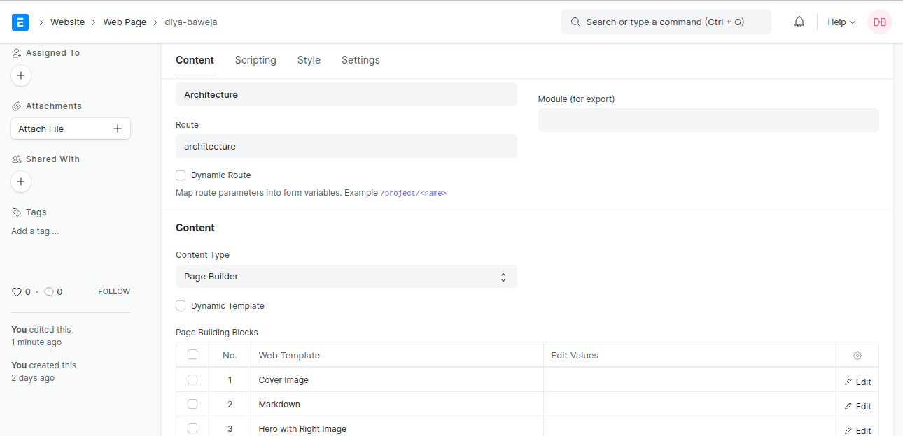

- Add rows in Page Building Blocks section, choose your desired web templates.

- Click on Save.

- On the top-left side, click on See on Website to view the output.

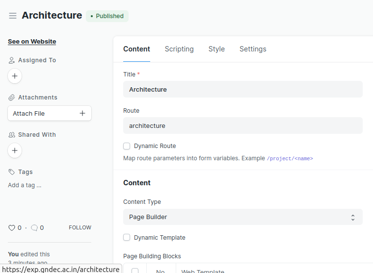
  

## Various Web Templates

### Cover Image

In this you need to provide a link for the image under `Image` section and you may provide description in case image is not visible. This image will appear on the top of your web page and gives the first impression to the viewers.

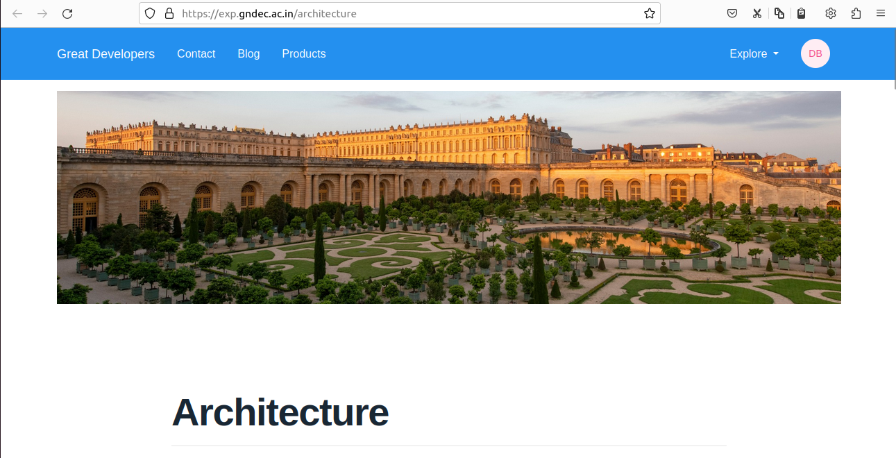

### Section with Collapsible Content

In this you can display large amount of information divided into parts in less space and in an attractive manner.

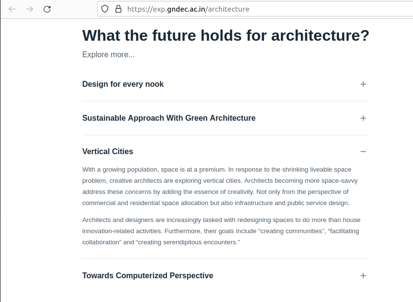

### Discussions

Using this web template, you can create a comments section where the viewers can express their views for your web page and give suggestions.

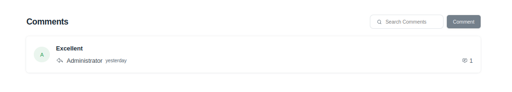

### Markdown

In this, we can use the powerful feature of markdown to enhance our webpage. For more about markdown, [click here](https://www.markdownguide.org/cheat-sheet/) 

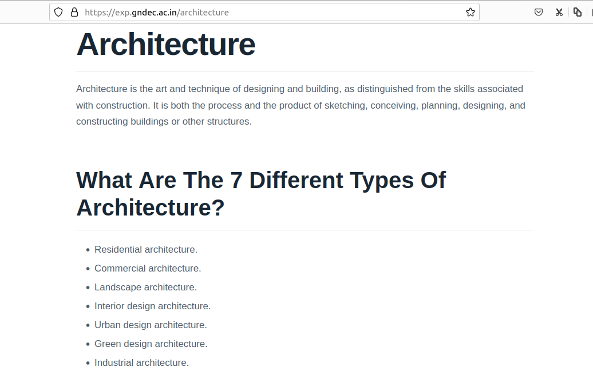

### Hero

It includes a Title, Sub-title, Primary Action Label and Secondary Action Label.

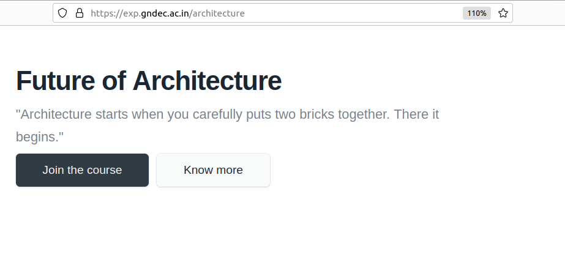

### Hero Slider

It has more features than Hero and also provides a slider.

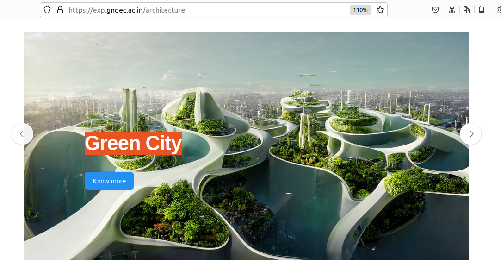

### Hero with Right Image

It depicts Title, Sub-title, Primary Action Label and Secondary Action Label with an image on right-side.

### Full Width Image

### Section with cards

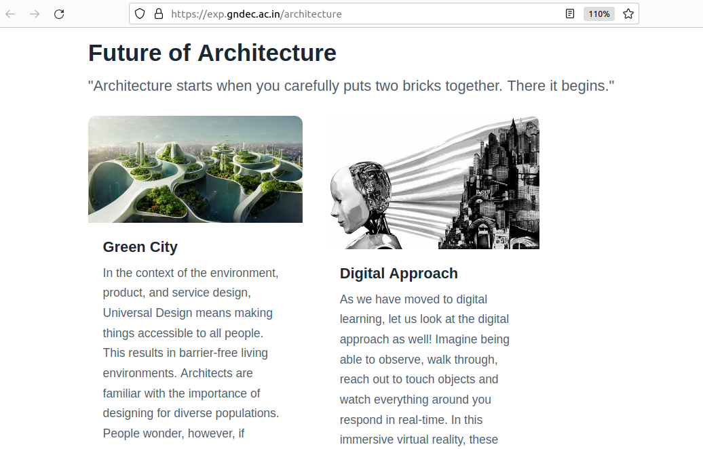

### Section with Features

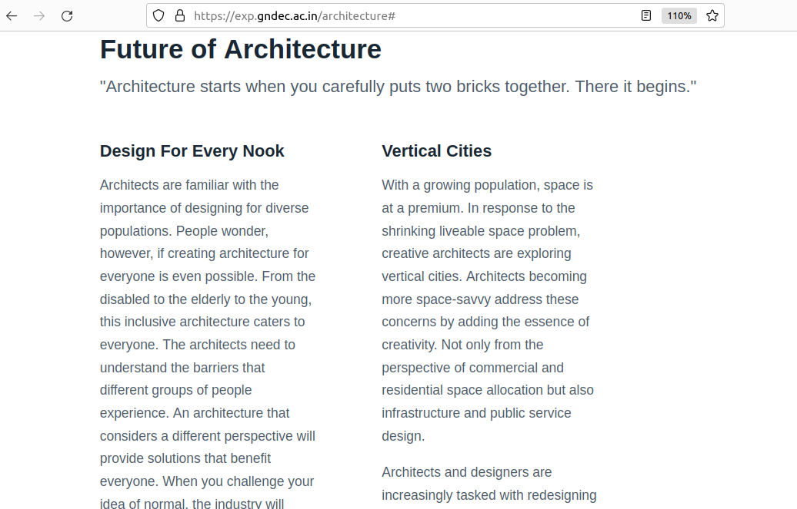

### Section with Image

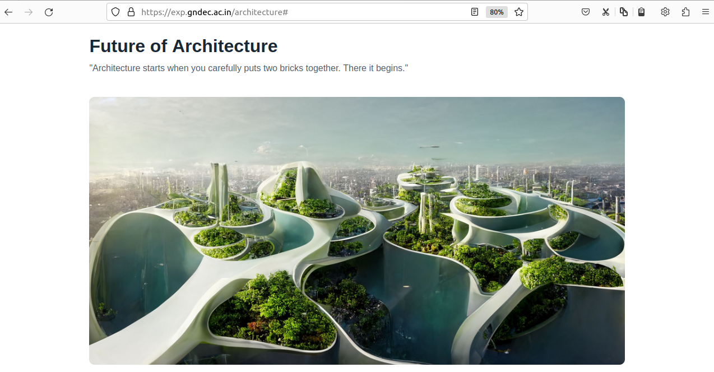

### Section with tabs

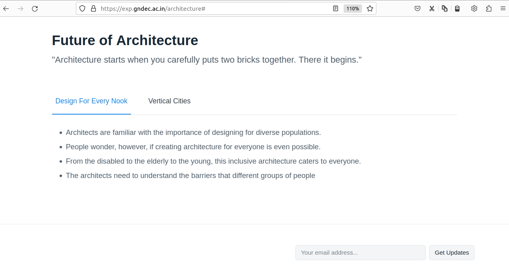

### Section with image grid

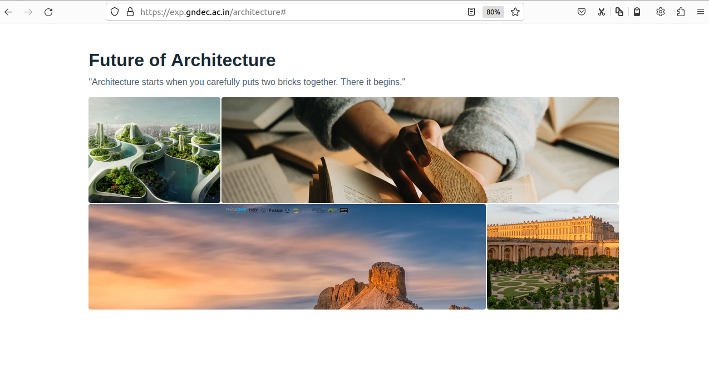

### Section with CTA

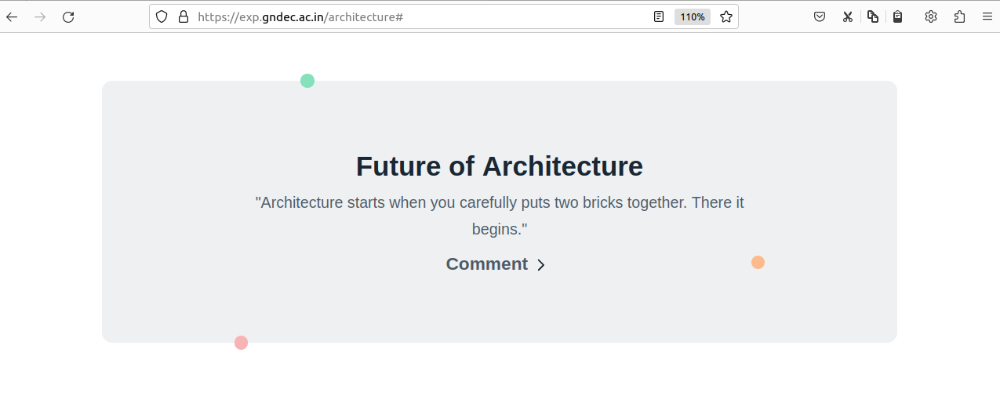

### Section with small CTA

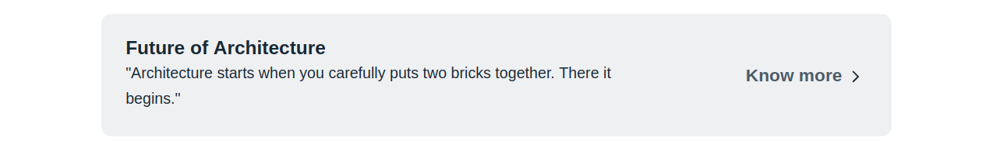

### Section with videos

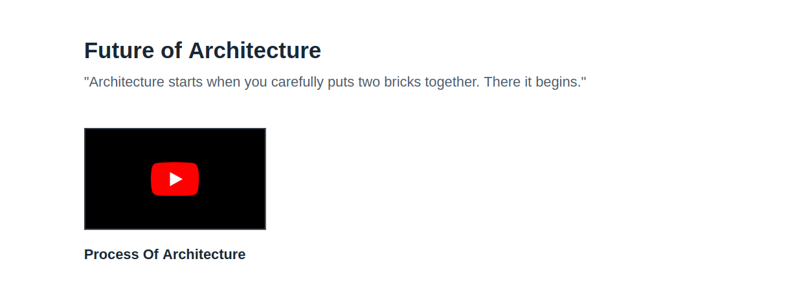

### Section with embed

### Section with testimonials

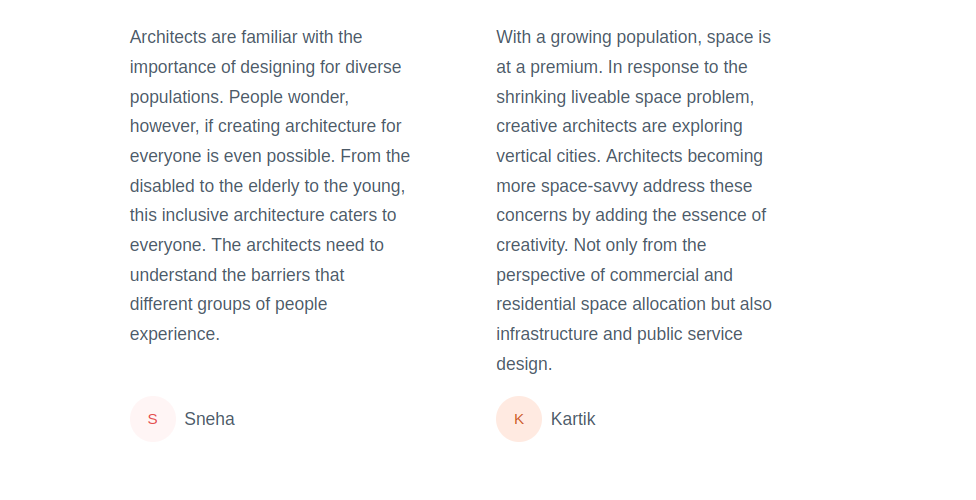

### Slideshow

### Split section with image

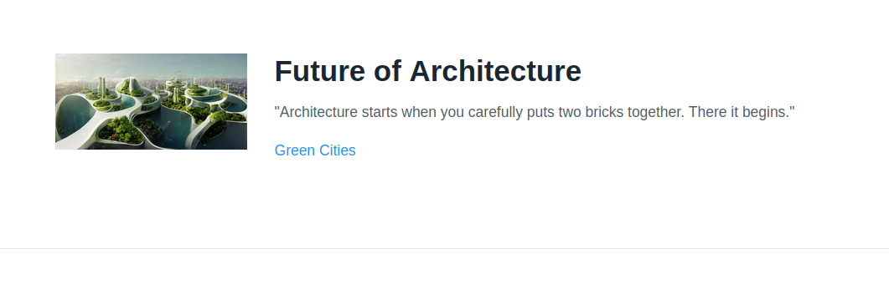

### Testimonial

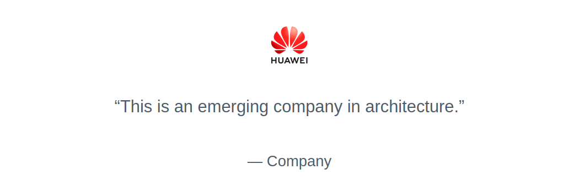
